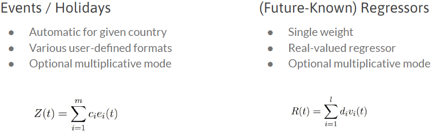

<h1 align="center">
  <a href="https://kelvinsa0528.wixsite.com/tradinghero" target="_blank">Trading Hero</a>   Empowering Traders with AI Stock Analysis
</h1>

<!--  -->
<!--

-->

  

Trading Hero is an advanced stock market analysis tool designed to streamline trading processes, reduce information overload, and enhance decision-making for semi-professional retail traders.

# **📑 Table of Contents**

1. [Project Motivation](#Project-Motivation)
2. [Overview of Trading Hero](#Overview)
   * [Project Diagram](#Project-Diagram)  
3. [Project Components](#Project-Components) 
   * [Trading Hero AI Technical Summary](#AI-Technical)
   * [Trading Hero AI EPS Summary](#EPS)
   * [Stock Analyst Recommendations](#Recommendations)
   * [Trading Hero AI News Analysis](#News-Analysis)
   * [Trading Hero Time Series Forecasting](#Time-Series)
   * [Trading Hero Final Report](#Final-Report)
4. [Technical Challenges](#Technical-Challenges)
5. [Market Potential](#Market-Potential)
6. [Future Developments](#Future-Developments)
   * [Additional Features](#Additional-Features)
   * [Next Steps Timeline](#Next-Steps)
7. [Conclusion](#Conclusion)
8. [Tools Utilized](#Tools-Utilized)
9. [References](#References)
10. [Acknowledgements/About Us](#Acknowledgements)

# **🎯 Project Motivation** 

Trading Hero was inspired by the challenges faced by semi-professional retail traders who often juggle multiple platforms / screens to conduct technical, fundamental, and news analysis...etc. This scattered approach frequently leads to information overload, inefficiencies, and missed opportunities.

  

### **How Trading Hero Makes a Difference**  
Trading Hero unifies essential data sources, empowering traders to make informed decisions quickly and effectively. With our AI-driven insights, we provide a **simplified report** that consolidates complex data into actionable guidance, making it easier to analyze and respond to market trends.
Ultimately, Trading Hero strives to be your comprehensive **AI Financial Advisor**—helping you navigate the market with confidence and clarity.

# **🧠 Overview of Trading Hero** 

### Project Diagram 

# 🧩 Project Components 

### 📈 Stock Overview Dashboard 
Users can explore real-time market data, top stock gainers and losers, and perform both fundamental and technical analysis on U.S. stocks. The dashboard features a search functionality that allows users to look up specific stock tickers across NYSE and Nasdaq exchanges, while also offering customizable historical analysis. 

The dashboard integrates financial data and visualizations from TradingView and AI-driven insights to help users make informed decisions. Additionally, users can view detailed financial metrics, company profiles, and generate an AI-powered technical summary for deeper analysis.

### 📋 Historical Stock and EPS Surprises  
This page provides users with a detailed historical analysis of selected stocks, featuring end-of-day stock data such as open, high, low, close prices, and trading volume. Users can observe key stock performance trends and make data-driven decisions based on past market behavior. Additionally, the Historical EPS Surprises section visualizes a stock’s earnings per share (EPS) performance, highlighting whether the company met, exceeded, or missed analyst expectations. A dedicated Trading Hero AI EPS Analysis button allows users to generate AI-powered insights on the stock’s EPS trends for further analysis.

### 💡 Stock Analyst Recommendations  
This page presents users with a comprehensive overview of analyst recommendations for selected stocks. The page also includes a sentiment analysis that highlights the overall sentiment toward the stock based on the collective recommendations.

### 🔮 Trading Hero AI News Analysis 

  

Trading Hero leverages cutting-edge **Natural Language Processing (NLP)** to perform comprehensive sentiment analysis on a vast number of news articles across different financial domains. This tool is designed to assist investors in making informed decisions by offering insights into the sentiment of articles related to specific stocks.

#### Overview

The Trading Hero Financial Sentiment Analysis model is trained on a wide variety of financial texts, including corporate reports, earnings call transcripts, and analyst reports. By fine-tuning a pre-trained BERT-based model, the system provides accurate sentiment analysis that helps investors gauge market sentiment towards specific stocks and sectors.

You can explore our model on our Hugging Face page 🤗:
[Trading Hero LLM on Hugging Face](https://huggingface.co/fuchenru/Trading-Hero-LLM )

#### Evaluation Metrics

The model was evaluated on several metrics to ensure high performance in analyzing financial news sentiment:

| Metric           |   Value   |
|------------------|:---------:|
| **Test Accuracy** |  90.85%   |
| **Test Precision**|  92.78%   |
| **Test Recall**   |  90.85%   |
| **Test F1 Score** |  91.33%   |

### 🔮 Trading Hero: Advanced Time Series Forecasting 

  

Trading Hero leverages a sophisticated deep learning approach for sequential learning in time-series data. While Facebook's Prophet model was developed to provide a flexible, user-friendly, and explainable framework for time series prediction, it often falls short in terms of accuracy. To address these performance limitations, we integrated Neural Networks with Prophet, creating **NeuralProphet**—a hybrid model designed to enhance predictive performance while preserving the interpretability that Prophet is known for.

#### Hybrid Approach: Neural Networks + Prophet
The core of this method is combining the strengths of a **Feed-Forward Neural Network** with Prophet's statistical time-series forecasting capabilities. By incorporating deep learning, the model can better capture complex temporal patterns, offering greater predictive accuracy and efficiency. This hybrid approach allows us to strike a balance between **model interpretability** (critical in many industries like finance and healthcare) and **state-of-the-art performance** on time-series data.

  
| Metric               |   Facebook Prophet   |   NeuralProphet   |
|----------------------|:--------------------:|:-----------------:|
| **Mean Average**      |  42.10%              |  34.06%           |
| **Median**            |  25.26%              |  19.65%           |
| **Minimum**           |  3.98%               |  2.67%            |
| **Maximum**           |  200%                |  200%             |
| **Standard Deviation**|  44.95%              |  37.51%           |

These improvements reflect the added capacity of neural networks to learn from complex patterns in sequential data, reducing error rates across key metrics.

#### Key Model Features and Enhancements

**1. Optimization with PyTorch**  
The optimization process is powered by **Gradient Descent** using PyTorch as the backend, ensuring scalability, efficiency, and flexibility when training the model on large datasets.

**2. Piecewise Linear Trend with Automatic Changepoints**  
To handle non-linear data, the model uses **piecewise linear trend analysis** with automatic changepoint detection. This allows the model to adapt to sudden shifts in the data, such as seasonal changes or economic events.

**3. Fourier Term Seasonality**  
The model incorporates **Fourier terms** to capture seasonality across multiple time frames (e.g., yearly, weekly, daily, hourly). This makes it versatile for a variety of time-dependent phenomena, such as daily stock movements or yearly sales cycles.

**4. Lagged and Future Regressors**  
- **Lagged Regressors**: The model can include historical features such as sensor data or past stock prices as inputs to improve predictions.
- **Future Regressors**: Known future events (e.g., temperature forecasts, planned holidays) can be added as additional variables, further improving forecast accuracy.

**5. Country Holidays and Recurring Events**  
The model has built-in support for country-specific holidays and recurring events, which can have significant effects on demand and other time-series metrics.

**6. Autocorrelation Modeling with AR-Net**  
The model includes **AR-Net**, a neural extension for autocorrelation modeling, which significantly improves its ability to capture dependencies within time-series data (e.g., stock prices, demand forecasting).

#### Why Use NeuralProphet?

By combining the statistical foundation of Facebook's Prophet with the powerful learning capabilities of Neural Networks, NeuralProphet is an excellent tool for anyone looking to tackle complex time-series forecasting problems. With the ability to capture intricate patterns in sequential data, Trading Hero offers an advanced forecasting solution that stands out for both its performance and user-centric design.

### 🔮 Trading Hero Final Report: Empowering Traders with AI Insights 

  

The **Trading Hero Final Report** provides traders with a concise, AI-driven summary of key insights, offering a clear and actionable view of market trends and stock performance.

#### **How the Final Report Helps Traders:**

1. **Unified Market Insights**  
   A single, consolidated report combines stock trends, earnings data, sentiment analysis, and forecasts, giving traders a complete market overview without needing to jump between tools.

2. **AI-Enhanced Decision-Making**  
   AI insights help traders interpret data more effectively, identifying opportunities and risks with precision for smarter, faster actions.

3. **Reduced Information Overload**  
   The report distills complex datasets into clear, actionable insights, allowing traders to make decisions without being overwhelmed by excessive data.

4. **Predictive Power**  
   Forecasts and trends in the report help traders anticipate market movements, enabling proactive strategy adjustments.

5. **Customizable and Relevant**  
   Tailored to individual needs, the report focuses on specific stocks or market events, ensuring traders get the most relevant insights for their goals.

In short, the **Trading Hero Final Report** simplifies decision-making, providing essential insights for smarter, more efficient trading.

# **⚙️ Technical Challenges** 
1. **Data Integration and Real-Time Processing**: Aggregating real-time data from multiple sources—including stock exchanges, financial news outlets, and analyst reports—required robust data pipelines. Ensuring data accuracy and minimal latency was critical for providing timely insights to users.
2. **Scalability and Performance**: Designing an architecture capable of handling high volumes of data and concurrent user requests was essential. We implemented efficient algorithms and leveraged cloud computing resources to maintain optimal performance as the user base grows.
3. **Advanced AI Model Development**: Integrating neural networks with models like Facebook’s Prophet to create NeuralProphet demanded extensive research and experimentation. Balancing model complexity with interpretability was a key challenge to ensure users trust the AI-generated insights.
4. **Natural Language Processing (NLP)**: Training the sentiment analysis model on financial texts required specialized NLP techniques to understand domain-specific language and nuances. Achieving high accuracy in sentiment classification was essential for reliable news analysis.
5. **User Interface and Experience**: Crafting an intuitive and user-friendly interface that caters to both semi-professional traders and beginners involved iterative design and user testing. Ensuring seamless navigation and accessibility of complex data was a significant challenge.

# **🚀 Market Potential** 
1. **Growing Demand**: The AI trading market is projected to reach $50.4 billion by 2033, growing at a 10.7% CAGR. This surge reflects the expanding retail trading sector’s need for intelligent, user-friendly trading tools.
2. **Competitive Edge**: Trading Hero bridges a crucial gap by offering advanced analytics suitable for semi-professional traders yet intuitive enough for beginners, setting us apart from complex professional platforms.
3. **Global Opportunities**: With retail trading on the rise globally, Trading Hero is ready to scale internationally, providing accessible, cutting-edge tools worldwide.
4. **Future Developments**: Our future plans include mobile access to bring Trading Hero to users wherever they are and partnerships with financial institutions to expand our market reach and impact.

Trading Hero is poised to lead the AI trading revolution, meeting today’s needs and setting new standards for the future.

# **🛠️ Future Developments** 

### Possibilities 
1. **Mobile Application Development**: Launching a mobile app to provide users with on-the-go access to Trading Hero’s features, enhancing convenience and engagement.
2. **Enhanced AI Capabilities**: Incorporating advanced AI models, such as reinforcement learning for adaptive trading strategies and personalized recommendations based on user behavior.
3. **Partnerships with Financial Institutions**: Collaborating with banks, brokerage firms, and financial platforms to integrate Trading Hero’s tools, expanding our reach and credibility.
4. **Educational Resources**: Developing a comprehensive library of tutorials, webinars, and articles to educate users on trading strategies and the effective use of AI tools.
5. **Social Trading Features**: Introducing community-driven functionalities where users can share insights, strategies, and collaborate on market analysis.

### Next Steps Timeline 

#### **Q1 2024: Mobile App Launch**
- Develop and launch mobile applications for iOS and Android platforms.
- Optimize the user interface for mobile devices to enhance user experience on the go.

#### **Q2 2024: Enhanced AI Features**
- Integrate reinforcement learning models for adaptive trading strategies.
- Implement personalized recommendations based on user trading behavior and preferences.

#### **Q3 2024: Financial Partnerships**
- Establish partnerships with major financial institutions, including banks and brokerage firms.
- Integrate Trading Hero’s tools into partner platforms to expand market reach.

#### **Q4 2024: Educational Platform**
- Launch an educational resource center with tutorials, webinars, and articles.
- Host live events and workshops to engage the trading community.

#### **Q1 2025: Social Trading Features**
- Introduce community features allowing users to share insights and collaborate.
- Implement social feeds, forums, and collaborative analysis tools.

# **🔚 Conclusion** 

Trading Hero is positioned to lead the AI trading revolution by empowering traders with advanced yet accessible tools. We have successfully addressed key technical challenges to deliver a platform that enhances decision-making and streamlines trading processes. With significant market potential and a clear roadmap for future developments, Trading Hero is ready to scale globally and set new standards in the trading industry. Our commitment to innovation and user-centric design ensures we meet today’s needs while anticipating tomorrow’s opportunities.

# **🛠️ Tools Utilized** 

|  | Category | Tool(s) |
|----------|----------|----------|
| 1 | AI Models |  |
| 2 | Machine Learning | ,  |
| 3 | Backend |  |
| 4 | Frontend | , , ,  |
| 5 | Design | , , ,  |
| 6 | Project Management |  |
| 7 | Cloud Computing |  |
| 8 | Version Control |  |
| 9 | APIs | , , , ,  |
| 10 | Containerization |  |

# 📚 References 

Huang, A. H., & Yi Yang, H. W. (2022, September 22). FinBERT: A Large Language Model for Extracting Information from Financial Text. https://onlinelibrary.wiley.com/doi/10.1111/1911-3846.12832 

# 👤 Acknowledgements/About Us 

- Kelvin Hsueh ([@chsuehkelvin](https://github.com/chsuehkelvin))
- Peter Fu Chen  ([@fuchenru](https://github.com/fuchenru))  
- Yaoning Yu  ([@yyu6](https://github.com/yyu6))
- Nathan Chen ([@nathanchen07](https://github.com/nathanchen07))

<!--  -->
